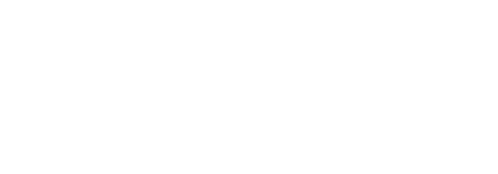
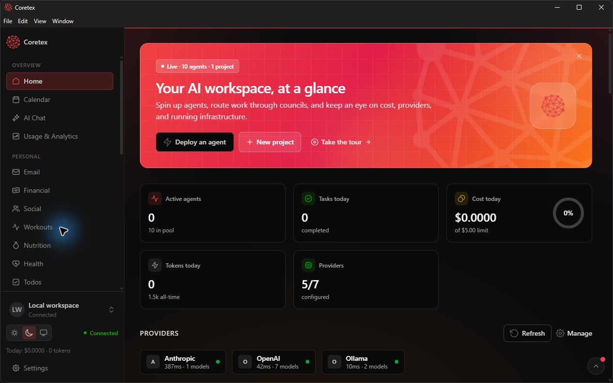
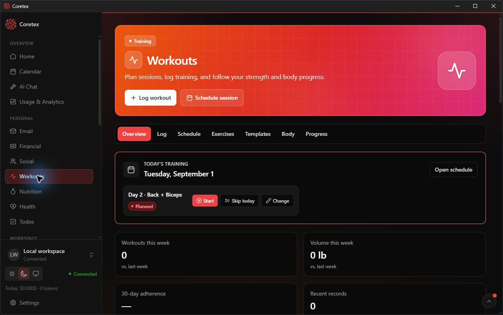
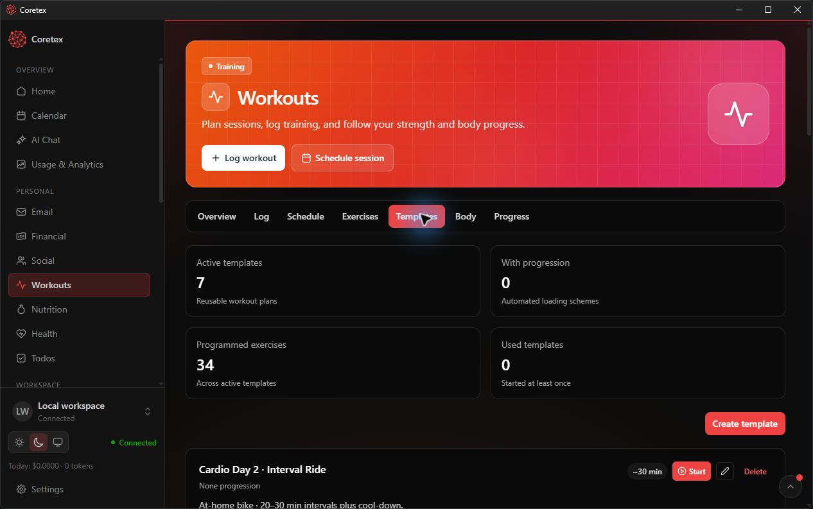

# Coretex

<p align="center">
  
</p>

<p align="center">
  A local-first workspace for AI agents, projects, productivity, personal analytics, and developer operations.
</p>

<p align="center">
  <a href="https://github.com/MDCran/coretex/actions/workflows/security.yml"></a>
  <a href="https://github.com/MDCran/coretex/actions/workflows/codeql.yml"></a>
</p>

Coretex brings the tools used to run work and life into one focused Windows desktop app. It combines agent orchestration, project planning, communication, local infrastructure, and personal tracking behind a responsive React interface.

## Screenshots

<p align="center">
  
</p>

<p align="center"><sub>Home workspace — agents, providers, projects, usage, and infrastructure at a glance.</sub></p>

<table>
  <tr>
    <td width="50%">
      
    </td>
    <td width="50%">
      
    </td>
  </tr>
  <tr>
    <td align="center"><sub>Today’s workout, scheduling controls, and progress metrics.</sub></td>
    <td align="center"><sub>Reusable strength and cardio templates with programmed exercises.</sub></td>
  </tr>
</table>

## Highlights

- Orchestrate AI agents, councils, plans, tasks, and projects.
- Work with chat, email, calendars, files, databases, Docker, servers, terminals, environment variables, and remote systems.
- Track workouts, nutrition, health, finances, social activity, and usage analytics.
- Keep credentials out of the repository with dedicated local settings and vault surfaces.
- Use the same shared application layer across the Electron desktop and Next.js web clients.

## Architecture

| Workspace | Purpose |
| --- | --- |
| `apps/desktop` | Electron and Vite Windows desktop app |
| `apps/web` | Next.js web client |
| `shared` | Shared React and Untitled UI application layer |
| `coretex` | TypeScript Brain service, integrations, Prisma, and PostgreSQL |
| `combined` | Standalone LifeOS web app and its isolated Docker stack |
| `scripts` | Build, verification, security, and release tooling |

## Requirements

- Windows 10 or later
- [Node.js 24](https://nodejs.org/)
- npm
- [Docker Desktop](https://www.docker.com/products/docker-desktop/)

## Run locally

```powershell
git clone https://github.com/MDCran/coretex.git
cd coretex
npm ci
npm run desktop:live
```

The live command starts the development Brain and Electron app. It also ensures the local PostgreSQL Docker service is healthy and applies pending Prisma migrations.

To start the Brain, web client, and desktop app together:

```powershell
npm run dev
```

## Useful commands

| Command | Purpose |
| --- | --- |
| `npm run desktop:live` | Run the desktop app with live reload |
| `npm run dev` | Run Brain, web, and desktop together |
| `npm run build` | Build the web and desktop applications |
| `npm run check:brain` | Type-check the Coretex Brain |
| `npm run smoke:release` | Run the offline release-contract suite |
| `npm run desktop:installer` | Build a local Windows installer |
| `npm audit` | Check the dependency graph for known advisories |

## Local data and privacy

Production data is stored beneath `~/.coretex`; development uses `~/.coretex-dev`. Environment files, credentials, browser profiles, database exports, logs, and personal documents are intentionally excluded from Git.

Before contributing or publishing a release:

```powershell
docker run --rm -v "${PWD}:/repo" zricethezav/gitleaks:v8.30.1 git /repo --redact --no-banner
npm audit
```

See [SECURITY.md](SECURITY.md) for the security policy and [apps/desktop/README.md](apps/desktop/README.md) for Windows packaging and update details.

## Releases

The desktop package version is the release source of truth. Stable releases use an exact `v<version>` tag and release notes from [CHANGELOG.md](CHANGELOG.md). Publishing requires configured Windows code-signing credentials; manual workflow runs are dry by default.

No binary release or version tag has been published yet. The prepared `0.1.0`
changelog documents the first release contents; publication still requires a
verified, signed build from the exact version tag.

Coretex is pre-1.0 software. Review permissions and back up local data before connecting important accounts or infrastructure.

## Ownership

Built and maintained by [MDCran](https://github.com/MDCran).
